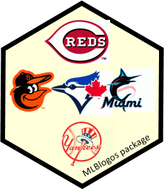

<!-- README.md is generated from README.Rmd. Please edit that file -->

```{r, include = FALSE}
knitr::opts_chunk$set(
  collapse = TRUE,
  message = FALSE,
  warning = FALSE,
  comment = "#>",
  fig.path = "man/figures/README-",
  out.width = "80%",
  fig.height = 5,
  fig.width = 7
)
```

# MLBlogos  
Version `r packageVersion("MLBlogos")`

<!-- badges: start -->
[](https://lifecycle.r-lib.org/articles/stages.html#experimental)
<!-- badges: end -->

The `MLBlogos` package provides small (150 x 100) logos for the teams in Major League Baseball
(from the 2021 season). Right to use these thumbnail images, **only** for non-commercial purposes, is kindly provided by Chris Creamer of [sportslogos.net](https://www.sportslogos.net).

The uses are to create tables and graphs of Teams data from the [Lahman package](https://github.com/cdalzell/Lahman).

## Installation

This package is still experimental, and not on CRAN.
You can install the current version of `MLBlogos` from [GitHub](https://github.com/friendly/MLBlogos) with:

``` r
# install.packages("devtools")
devtools::install_github("friendly/MLBlogos")
```

## Examples

This is a basic example which shows how to access information about the logos and the images themselves.

Information about the logos is contained in the `Logos` data set. The file
name of each logo (in PNG format) is contained in the `img` variable.
`TeamID` is the matching variable in the `Lahman::Teams` dataset.

```{r example}
library(MLBlogos)
data(Logos)
library(dplyr)

data(Logos)
knitr::kable(Logos[c(1:5, 26:30), 1:5])
```

### Retrieving logos
The `logoInfo` function allows you to select images from the installed `inst/png/` 
folder. It takes a vector of one or more `teamID` and returns selected
variables from the `Logos` table. 

Of these variables, for each `teamID`,

* `name` is the team name
* `img` is the filename of the logo in the `inst/png/` folder
* `image` is the filename **path** to the logo in the package.

The actual image can be retrieved using `magick::image_read()` or
`png::readPNG()`.

```{r oneimage, out.width="20%", fig.height=3, fig.align='center', fig.show='asis'}

(toronto <- logoInfo("TOR"))

# Get the filename for the Toronto Blue Jays logo. Read it using `magick::image_read()`
# and display it.
imagepath <- toronto[, "image"]
img <- magick::image_read(imagepath)
print(img)
```

### All logos
Here are all the logos, retrieved from the `inst/png` folder of the source package.
For this document they are displayed using HTML `` tags.
(Except that in a GitHub document they are displayed one-by-one, rather than in an
array. I cheated a bit and took a screenshot of how it appears in the R Studio HTML file.)
```{r allimages, echo=TRUE, eval=FALSE}
library(glue)
glue("")
```


## Using logos in graphics

These examples show how to use these logos in `ggplot2` graphics.
The essential step is to merge (`left_join()`) the data to be plotted
with the names of the logo images from this package.

Images are plotted using `ggimage::geom_image()`.

Load packages and data
```{r load}
library(Lahman)
library(dplyr)
library(ggplot2)
library(ggimage)

data(Salaries)
data(Logos)
```

### Bar charts

Create a simple bar plot of total team salaries for the 2016 season,
the last year for which salary data is available. 

Select teams in the American League to avoid too many bars.
For this example, reorder the teamIDs by increasing Salary.  
```{r get-salary}
# Total team salaries by league, team for 2016
teamSalaries <- Salaries |>
  filter(yearID == max(yearID),
         lgID == "AL") |>
  group_by(teamID) |>
  summarise(Salary = sum(as.numeric(salary))) |>
  arrange(Salary) |>
  # re-order levels for plotting
  mutate(teamID = factor(teamID, levels = unique(teamID)))
```

Get the name of the logo image file for each team:
```{r get-logos}
teamSalaries <- teamSalaries |>
  left_join(Logos, by="teamID") |>
  mutate(img = system.file(glue::glue("png/{img}"),
                           package = "MLBlogos")) |>
  select(teamID, name, Salary, divID, img)
```

Construct the bar plot. It took a bit of fiddling to size and position the logos within the
bars.
```{r salary-bars, out.width="80%"}
ggplot(teamSalaries,
       aes(teamID, Salary)) +
  geom_col(aes(fill=divID)) +
  scale_y_continuous(labels = scales::label_number(suffix = " M",
                                                   scale = 1e-6)) +  # millions
  scale_fill_discrete(
    labels = c("Central", "East", "West")
    ) +
  geom_image(aes(image=img, y = .6 *Salary),
             size=0.08) +
  labs(y = "Total Salary",
       fill = "Division") +
  coord_flip() +
  theme_bw(base_size=16) +
  theme(legend.position = c(.9, .2))
```

### Scatterplots

Plot the number of team wins against home runs and attendance.

```{r}
data(Teams, package="Lahman")

# ------------------------------------------
# get Xs and wins for most recent year, 2021
# ------------------------------------------
teamdata <- Teams |>
  filter(yearID == max(yearID)) |>
  select(teamID, HR, W, attendance)

# ------------------------------------------
# get the logo for each team
# ------------------------------------------
teamdata <- teamdata |>
  left_join(Logos, by="teamID") |>
  mutate(img = system.file(glue::glue("png/{img}"),
                           package = "MLBlogos")) |>
  select(teamID, divID, HR, W, attendance, img)

```

Home runs and wins. We would expect a positive relationship.
```{r W-HR}
# ------------------------------------------
# plot home runs and wins
# ------------------------------------------
ggplot(data=teamdata,
       aes(x = HR, y=W)) +
  geom_point() +
  geom_smooth(method = "loess", formula = y~x, se = FALSE, size = 2) +
  geom_image(aes(image=img, x = HR, y = W),
             size=0.05) +
  labs(x = "Home Runs",
       y = "wins") +
  theme_bw(base_size = 16)

```

Attendance and wins. The overall relationship is mildly positive, but there are some
large outliers.
```{r W-attendance}
# ------------------------------------------
# plot attendance and wins
# ------------------------------------------
ggplot(data=teamdata,
       aes(x = attendance, y=W)) +
  geom_point() +
  geom_smooth(method = "loess", formula = y~x, se = FALSE, size = 2) +
  geom_image(aes(image=img, x = attendance, y = W),
             size=0.05) +
  scale_x_continuous(labels = scales::label_number(suffix = " K",
                                                   scale = 1e-3)) +
  labs(x = "Attendance",
       y = "wins") +
  theme_bw(base_size = 16)

```

## Technical note

The PNG images do not have a completely transparent background, so appear best in graphs with
a white background.
