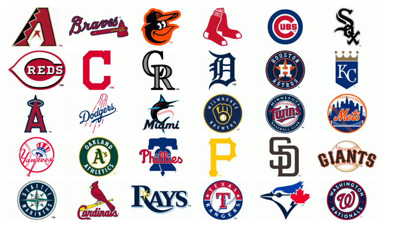

<!-- README.md is generated from README.Rmd. Please edit that file -->

```{r, include = FALSE}
knitr::opts_chunk$set(
  collapse = TRUE,
  message = FALSE,
  comment = "#>",
  fig.path = "man/figures/README-",
  out.width = "100%"
)
```

# MLBlogos

<!-- badges: start -->
[](https://lifecycle.r-lib.org/articles/stages.html#experimental)
<!-- badges: end -->

The MLBlogos package provids small (150 x 100) logos for the teams in Major League Baseball
(from the 2021 season).
A possible use is to create tables and graphs of Teams data from the [Lahman package](https://github.com/cdalzell/Lahman).

## Installation

You can install the development version of MLBlogos from [GitHub](https://github.com/) with:

``` r
# install.packages("devtools")
devtools::install_github("friendly/MLBlogos")
```

## Example

This is a basic example which shows how to access information about the logos and the images themselves.

```{r example}
library(MLBlogos)
data(Logos)
library(dplyr)

## Information about the logos is contained in the `Logos` data set. The file
## name of each logo (in PNG format) is contained in the `png` variable.
## `TeamID` is the matching variable in `Lahman::Teams`.

data(Logos)
knitr::kable(Logos[c(1:5, 26:30), 1:4])
```

### Retrieving logos
```{r oneimage, out.width="20%", fig.height=3, fig.align='center'}
# Get the installed directory of the logo files in the package
dir <- system.file("png/", package = "MLBlogos")

# Select an image, use `magick::image_read()` to read it from the installed directory
imagename <- logoInfo(c("TOR"))[, "png"]
img <- magick::image_read(file.path(dir, imagename))
print(img)
```

Here are all the logos, retrieved from the `inst/png` folder of the source package.
For this document they are displayed using HTML `` tags.
```{r allimages, echo=TRUE, eval=FALSE}
library(glue)
glue("")
```




