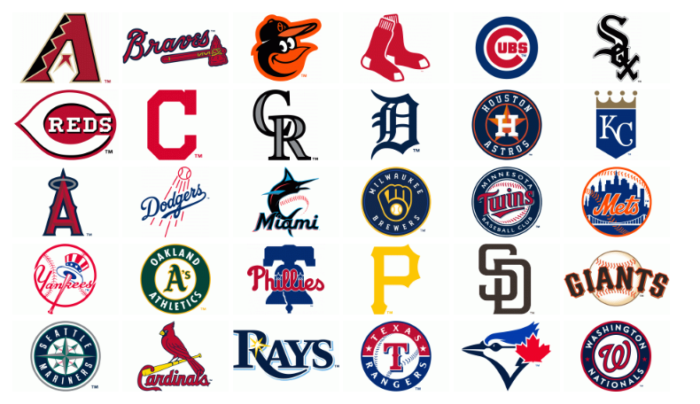
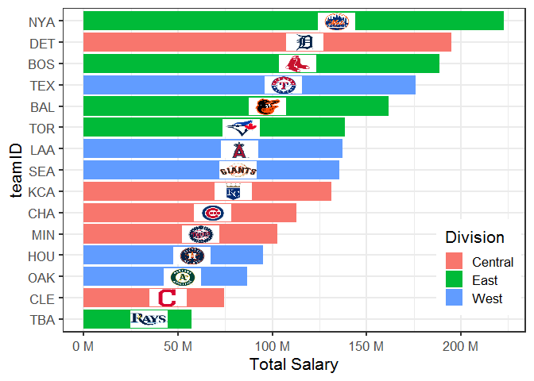
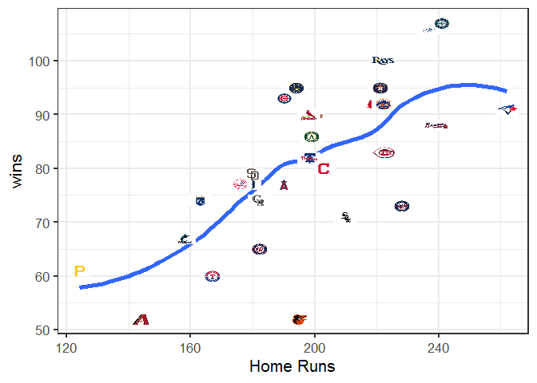
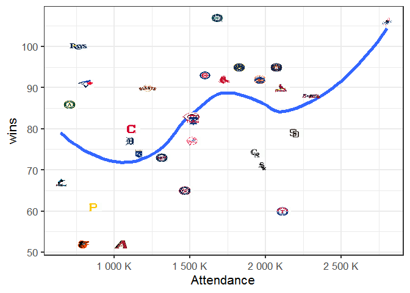

README
================

<!-- README.md is generated from README.Rmd. Please edit that file -->

# MLBlogos

<!-- badges: start -->

[](https://lifecycle.r-lib.org/articles/stages.html#experimental)
<!-- badges: end -->

The MLBlogos package provides small (150 x 100) logos for the teams in
Major League Baseball (from the 2021 season). A possible use is to
create tables and graphs of Teams data from the [Lahman
package](https://github.com/cdalzell/Lahman).

## Installation

You can install the development version of MLBlogos from
[GitHub](https://github.com/friendly/MLBlogos) with:

``` r
# install.packages("devtools")
devtools::install_github("friendly/MLBlogos")
```

## Examples

This is a basic example which shows how to access information about the
logos and the images themselves.

Information about the logos is contained in the `Logos` data set. The
file name of each logo (in PNG format) is contained in the `png`
variable. `TeamID` is the matching variable in the `Lahman::Teams`
dataset.

``` r
library(MLBlogos)
data(Logos)
library(dplyr)

data(Logos)
knitr::kable(Logos[c(1:5, 26:30), 1:5])
```

|     | teamID | lgID | divID | name                 | png                      |
|:----|:-------|:-----|:------|:---------------------|:-------------------------|
| 1   | ARI    | NL   | W     | Arizona Diamondbacks | Arizona_Diamondbacks.png |
| 2   | ATL    | NL   | E     | Atlanta Braves       | Atlanta_Braves.png       |
| 3   | BAL    | AL   | E     | Baltimore Orioles    | Baltimore_Orioles.png    |
| 4   | BOS    | AL   | E     | Boston Red Sox       | Boston_Red_Sox.png       |
| 5   | CHA    | AL   | C     | Chicago Cubs         | Chicago_Cubs.png         |
| 26  | SLN    | NL   | C     | St. Louis Cardinals  | St_Louis_Cardinals.png   |
| 27  | TBA    | AL   | E     | Tampa Bay Rays       | Tampa_Bay_Rays.png       |
| 28  | TEX    | AL   | W     | Texas Rangers        | Texas_Rangers.png        |
| 29  | TOR    | AL   | E     | Toronto Blue Jays    | Toronto_Blue_Jays.png    |
| 30  | WAS    | NL   | E     | Washington Nationals | Washington_Nationals.png |

### Retrieving logos

``` r
# Get the installed directory of the logo files in the package
dir <- system.file("png/", package = "MLBlogos")

# Select an image, use `magick::image_read()` to read it from the installed directory
imagename <- logoInfo(c("TOR"))[, "png"]
img <- magick::image_read(file.path(dir, imagename))
print(img)
#> # A tibble: 0 x 7
#> # ... with 7 variables: format <chr>, width <int>, height <int>,
#> #   colorspace <chr>, matte <lgl>, filesize <int>, density <chr>
```

Here are all the logos, retrieved from the `inst/png` folder of the
source package. For this document they are displayed using HTML ``
tags. (Except that in a GitHub document they are displayed one-by-one,
rather than in an array.)

``` r
library(glue)
glue("")
```



## Using logos in graphics

These examples show how to use these logos in `ggplot2` graphics. The
essential step is to merge (`left_join()`) the data to be plotted with
the names of the logo images from this package.

Images are plotted using `ggimage::geom_image()`.

Load packages and data

``` r
library(Lahman)
library(dplyr)
library(ggplot2)
library(ggimage)

data(Salaries)
data(Logos)
```

### Bar charts

Create a simple bar plot of total team salaries for the 2016 season, the
last year for which salary data is available.

Select teams in the American League to avoid too many bars. For this
example, reorder the teamIDs by increasing Salary.

``` r
# Total team salaries by league, team for 2016
teamSalaries <- Salaries |>
  filter(yearID == max(yearID),
         lgID == "AL") |>
  group_by(teamID) |>
  summarise(Salary = sum(as.numeric(salary))) |>
  arrange(Salary) |>
  # re-order levels for plotting
  mutate(teamID = factor(teamID, levels = unique(teamID)))
```

Get the name of the logo image file for each team:

``` r
teamSalaries <- teamSalaries |>
  left_join(Logos, by="teamID") |>
  mutate(img = system.file(glue::glue("png/{png}"),
                           package = "MLBlogos")) |>
  select(teamID, name, Salary, divID, img)
```

Construct the bar plot:

``` r
ggplot(teamSalaries,
       aes(teamID, Salary)) +
  geom_col(aes(fill=divID)) +
  scale_y_continuous(labels = scales::label_number(suffix = " M",
                                                   scale = 1e-6)) +  # millions
  geom_image(aes(image=img, y = Salary),
             size=0.09) +
  ylab("Total Salary (million $)") +
  coord_flip() +
  theme_bw(base_size=16) +
  theme(legend.position = c(.9, .2))
```



### Scatterplots

Plot the number of team wins against home runs and attendance.

``` r
data(Teams, package="Lahman")

# ------------------------------------------
# get Xs and wins for most recent year, 2021
# ------------------------------------------
teamdata <- Teams |>
  filter(yearID == max(yearID)) |>
  select(teamID, HR, W, attendance)

# ------------------------------------------
# get the logo for each team
# ------------------------------------------
teamdata <- teamdata |>
  left_join(Logos, by="teamID") |>
  mutate(img = system.file(glue::glue("png/{png}"),
                           package = "MLBlogos")) |>
  select(teamID, divID, HR, W, attendance, img)
```

Home runs and wins. We would expect a positive relationship.

``` r
# ------------------------------------------
# plot home runs and wins
# ------------------------------------------
ggplot(data=teamdata,
       aes(x = HR, y=W)) +
  geom_point() +
  geom_smooth(method = "loess", formula = y~x, se = FALSE) +
  geom_image(aes(image=img, x = HR, y = W),
             size=0.05) +
  labs(x = "Home Runs",
       y = "wins") +
  theme_bw(base_size = 16)
```



Attendance and wins. The overall relationship is mildly positive, but
there are some large outliers.

``` r
# ------------------------------------------
# plot attendance and wins
# ------------------------------------------
ggplot(data=teamdata,
       aes(x = attendance, y=W)) +
  geom_point() +
  geom_smooth(method = "loess", formula = y~x, se = FALSE) +
  geom_image(aes(image=img, x = attendance, y = W),
             size=0.05) +
  scale_x_continuous(labels = scales::label_number(suffix = " K",
                                                   scale = 1e-3)) +
  labs(x = "Attendance",
       y = "wins") +
  theme_bw(base_size = 16)
```



## Technical note

The PNG images do not have a transparent background, so appear best in
graphs with a white background.
