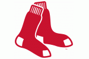
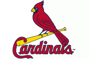

<!-- README.md is generated from README.Rmd. Please edit that file -->

# MLBlogos

<!-- badges: start -->

[](https://lifecycle.r-lib.org/articles/stages.html#experimental)
<!-- badges: end -->

The MLBlogos package provids small (150 x 100) logos for the teams in
Major League Baseball (from the 2021 season). A possible use is to
create tables and graphs of Teams data from the [Lahman
package](https://github.com/cdalzell/Lahman).

## Installation

You can install the development version of MLBlogos from
[GitHub](https://github.com/) with:

``` r
# install.packages("devtools")
devtools::install_github("friendly/MLBlogos")
```

## Example

This is a basic example which shows how to access information about the
logos and the images themselves.

``` r
library(MLBlogos)
data(Logos)
library(dplyr)

## Information about the logos is contained in the `Logos` data set. The file
## name of each logo (in PNG format) is contained in the `png` variable.
## `TeamID` is the matching variable in `Lahman::Teams`.

data(Logos)
knitr::kable(Logos[c(1:5, 26:30), 1:4])
```

|     | teamID | divID | name                 | png                      |
|:----|:-------|:------|:---------------------|:-------------------------|
| 1   | ARI    | W     | Arizona Diamondbacks | Arizona_Diamondbacks.png |
| 2   | ATL    | E     | Atlanta Braves       | Atlanta_Braves.png       |
| 3   | BAL    | E     | Baltimore Orioles    | Baltimore_Orioles.png    |
| 4   | BOS    | E     | Boston Red Sox       | Boston_Red_Sox.png       |
| 5   | CHA    | C     | Chicago Cubs         | Chicago_Cubs.png         |
| 26  | SLN    | C     | St. Louis Cardinals  | St_Louis_Cardinals.png   |
| 27  | TBA    | E     | Tampa Bay Rays       | Tampa_Bay_Rays.png       |
| 28  | TEX    | W     | Texas Rangers        | Texas_Rangers.png        |
| 29  | TOR    | E     | Toronto Blue Jays    | Toronto_Blue_Jays.png    |
| 30  | WAS    | E     | Washington Nationals | Washington_Nationals.png |

### Retrieving logos

``` r
# Get the installed directory of the logo files in the package
dir <- system.file("png/", package = "MLBlogos")

# Select an image, use `magick::image_read()` to read it from the installed directory
imagename <- logoInfo(c("TOR"))[, "png"]
img <- magick::image_read(file.path(dir, imagename))
print(img)
#> # A tibble: 1 x 7
#>   format width height colorspace matte filesize density
#>   <chr>  <int>  <int> <chr>      <lgl>    <int> <chr>  
#> 1 PNG      150    100 sRGB       TRUE      5750 38x38
```


Here are all the logos, retrieved from the `inst/png` folder:

``` r
library(glue)
glue("")
```








