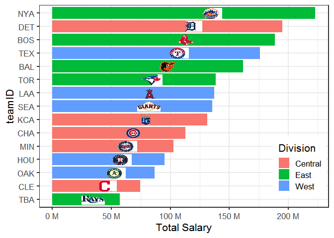

<!-- README.md is generated from README.Rmd. Please edit that file -->

# MLBlogos

<!-- badges: start -->

[](https://lifecycle.r-lib.org/articles/stages.html#experimental)
<!-- badges: end -->

The MLBlogos package provids small (150 x 100) logos for the teams in
Major League Baseball (from the 2021 season). A possible use is to
create tables and graphs of Teams data from the [Lahman
package](https://github.com/cdalzell/Lahman).

## Installation

You can install the development version of MLBlogos from
[GitHub](https://github.com/) with:

``` r
# install.packages("devtools")
devtools::install_github("friendly/MLBlogos")
```

## Example

This is a basic example which shows how to access information about the
logos and the images themselves.

``` r
library(MLBlogos)
data(Logos)
library(dplyr)

## Information about the logos is contained in the `Logos` data set. The file
## name of each logo (in PNG format) is contained in the `png` variable.
## `TeamID` is the matching variable in `Lahman::Teams`.

data(Logos)
knitr::kable(Logos[c(1:5, 26:30), 1:5])
```

|     | teamID | lgID | divID | name                 | png                      |
|:----|:-------|:-----|:------|:---------------------|:-------------------------|
| 1   | ARI    | NL   | W     | Arizona Diamondbacks | Arizona_Diamondbacks.png |
| 2   | ATL    | NL   | E     | Atlanta Braves       | Atlanta_Braves.png       |
| 3   | BAL    | AL   | E     | Baltimore Orioles    | Baltimore_Orioles.png    |
| 4   | BOS    | AL   | E     | Boston Red Sox       | Boston_Red_Sox.png       |
| 5   | CHA    | AL   | C     | Chicago Cubs         | Chicago_Cubs.png         |
| 26  | SLN    | NL   | C     | St. Louis Cardinals  | St_Louis_Cardinals.png   |
| 27  | TBA    | AL   | E     | Tampa Bay Rays       | Tampa_Bay_Rays.png       |
| 28  | TEX    | AL   | W     | Texas Rangers        | Texas_Rangers.png        |
| 29  | TOR    | AL   | E     | Toronto Blue Jays    | Toronto_Blue_Jays.png    |
| 30  | WAS    | NL   | E     | Washington Nationals | Washington_Nationals.png |

### Retrieving logos

``` r
# Get the installed directory of the logo files in the package
dir <- system.file("png/", package = "MLBlogos")

# Select an image, use `magick::image_read()` to read it from the installed directory
imagename <- logoInfo(c("TOR"))[, "png"]
img <- magick::image_read(file.path(dir, imagename))
print(img)
#> # A tibble: 0 x 7
#> # ... with 7 variables: format <chr>, width <int>, height <int>,
#> #   colorspace <chr>, matte <lgl>, filesize <int>, density <chr>
```

Here are all the logos, retrieved from the `inst/png` folder of the
source package. For this document they are displayed using HTML ``
tags. (Except that in a GitHub they are displayed one-by-one, rather
than in an array)

``` r
library(glue)
glue("")
```


## Using logos in graphics

This example shows how to use these logos in
`ggplot2 graphics. It creates a simple bar plot of total team salaries for the 2016 season, the last year for which salary data is available. Images are plotted using the`ggimage\`
package.

Load packages and data

``` r
library(Lahman)
library(dplyr)
library(ggplot2)
library(ggimage)

data(Salaries)
data(Logos)
```

Select teams in the National League

``` r
# Total team salaries by league, team for 2016 (last year available)
teamSalaries <- Salaries |>
  filter(yearID == max(yearID),
         lgID == "AL") |>
  group_by(teamID) |>
  summarise(Salary = sum(as.numeric(salary))) |>
  arrange(Salary) |>
  # re-order levels for plotting
  mutate(teamID = factor(teamID, levels = unique(teamID)))
```

Get the name of the logo image file for each team:

``` r
teamSalaries <- teamSalaries |>
  left_join(Logos, by="teamID") |>
  mutate(img = system.file(glue::glue("png/{png}"),
                           package = "MLBlogos")) |>
  select(teamID, name, Salary, divID, img)
```

Construct the bar plot:

``` r
ggplot(teamSalaries,
       aes(teamID, Salary)) +
  geom_col(aes(fill=divID)) +
  scale_y_continuous(labels = scales::label_number(suffix = " M",
                                                   scale = 1e-6)) +  # millions
  geom_image(aes(image=img, y = Salary),
             size=0.09) +
  ylab("Total Salary (million $") +
  coord_flip() +
  theme_bw(base_size=16) +
  theme(legend.position = c(.9, .2))
```


